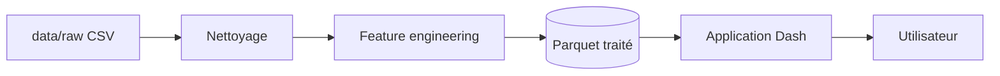

# Dashboard hospitalier

**Analyse médico-économique, visualisations interactives et rapports d’audit** — application web multi-pages orientée pilotage de l’activité hospitalière.

[](https://www.python.org/downloads/)
[](https://dash.plotly.com/)
[](https://plotly.com/python/)

---

## Sommaire

- [Aperçu](#aperçu)
- [Fonctionnalités](#fonctionnalités)
- [Stack technique](#stack-technique)
- [Prérequis](#prérequis)
- [Installation](#installation)
- [Lancer l’application](#lancer-lapplication)
- [Données et validation](#données-et-validation)
- [Variables d’environnement](#variables-denvironnement)
- [Déploiement (Render)](#déploiement-render)
- [Structure du dépôt](#structure-du-dépôt)

---

## Aperçu

Ce projet est un **tableau de bord analytique** construit avec **Dash** et **Plotly**. Il agrège des séjours hospitaliers (pathologies, départements, coûts, durées) et propose des filtres globaux persistants, des graphiques cohérents avec une charte sombre « clinical luxury », ainsi qu’un **rapport d’audit** exportable en **PDF** et des exports **Excel**.

Flux simplifié :



---

## Fonctionnalités

| Zone | Description |
|------|-------------|
| **Accueil** | KPIs, tendances d’admissions, répartition départements / sexe, coûts par pathologie, DMS |
| **Patients** | Profils démographiques, analyses par âge et sexe |
| **Pathologies** | Volumes, répartition et indicateurs par maladie |
| **Finances** | Distributions de coûts, corrélations, analyses par service et pathologie |
| **Séjours** | Durées, catégories de séjour, saisonnalité |
| **Rapport** | Synthèse narrative + export PDF et Excel selon les filtres actifs |

Les **filtres** (département, pathologie, sexe, tranche d’âge, traitement, période) sont partagés entre toutes les pages via un `dcc.Store` en session.

---

## Stack technique

- **Python 3.12** · **Dash** (multi-pages) · **Plotly**
- **Pandas** · **PyArrow** (Parquet)
- **ReportLab** (PDF) · **OpenPyXL** (Excel)
- **Gunicorn** (WSGI production) · **FastAPI / Uvicorn** optionnel (`asgi.py`)

---

## Prérequis

- Python **3.12** recommandé
- Fichier source **`data/raw/hospital_data.csv`** (séparateur `;`, encodage UTF-8)

---

## Installation

```bash
git clone <url-du-depot>.git
cd <dossier-du-projet>
python -m venv .venv
```

**Windows (PowerShell)**

```powershell
.\.venv\Scripts\Activate.ps1
pip install -r requirements.txt
```

**Linux / macOS**

```bash
source .venv/bin/activate
pip install -r requirements.txt
```

---

## Lancer l’application

**Mode développement (recommandé)**

```bash
python app.py
```

Puis ouvrir **http://127.0.0.1:8050** (le port suit la variable `PORT` dans `config.py`).

**Avec Uvicorn (ASGI + même interface Dash)**

```bash
python -m uvicorn asgi:app --host 127.0.0.1 --port 8000
```

**Plus proche de la production (Gunicorn)**

```bash
set DEBUG=false
gunicorn app:server --bind 127.0.0.1:8050 --workers 1 --threads 4 --timeout 120
```

---

## Données et validation

- Le chargeur (`utils/data_loader.py`) lit **`data/processed/hospital_clean.parquet`** s’il existe ; sinon il exécute le pipeline **nettoyage** (`utils/cleaning.py`) + **features** (`utils/feature_engineering.py`) à partir du CSV brut et génère le Parquet.
- Le dossier `data/processed/` peut être absent du dépôt (ignoré par Git) : le fichier est recréé au premier chargement ou pendant le build CI.

**Valider les données avant un déploiement**

```bash
python scripts/validate_data.py
```

Sortie attendue : message `[OK]` et code de sortie **0**. En cas d’échec, le script retourne **1** (schéma incomplet, lignes invalides, etc.).

---

## Variables d’environnement

| Variable | Rôle | Défaut |
|----------|------|--------|
| `DEBUG` | Mode debug Dash / Flask | `True` |
| `PORT` | Port d’écoute local | `8050` |
| `DASH_USE_RELOADER` | Rechargement auto du code (2 processus) | `false` |
| `DASH_DEV_TOOLS_PROPS_CHECK` | Validation des props Dash (plus lent) | `false` |
| `DASH_QUIET_LOADER` | Masque les logs `[LOADER]` au démarrage | `false` |

Sur **Render**, `PORT` est fourni par la plateforme ; définir **`DEBUG=false`** en production.

---

## Déploiement (Render)

Le dépôt inclut **`render.yaml`** (Blueprint) et **`Procfile`**.

1. Pousser le code sur Git en incluant **`data/raw/hospital_data.csv`**.
2. Créer un service sur [Render](https://render.com) à partir du Blueprint ou configurer manuellement :
   - **Build** : `pip install -r requirements.txt && python scripts/validate_data.py`
   - **Start** : `gunicorn app:server --bind 0.0.0.0:$PORT --workers 1 --threads 4 --timeout 120`

La version Python est indiquée dans **`runtime.txt`**.

---

## Structure du dépôt

```
hospital_dash_viz/
├── app.py                 # Point d’entrée Dash
├── asgi.py                # Point d’entrée ASGI (Uvicorn)
├── config.py              # Configuration globale
├── requirements.txt
├── runtime.txt
├── render.yaml            # Blueprint Render
├── Procfile
├── assets/
│   └── style.css          # Thème UI
├── callbacks/             # Callbacks partagés (filtres)
├── components/            # Layout, navbar, sidebar, graphiques
├── pages/                 # Pages Dash (routes)
├── scripts/
│   └── validate_data.py   # Contrôle qualité des données
├── utils/                 # Données, stats, PDF, etc.
└── data/
    ├── raw/               # CSV source (à versionner)
    └── processed/         # Parquet généré (souvent ignoré par Git)
```

---

## Crédits

Projet **Master 2 CSDS** — **Dashboard hospitalier** · Analyse & aide à la décision.

**Auteur :** Moustapha Ndoye  
